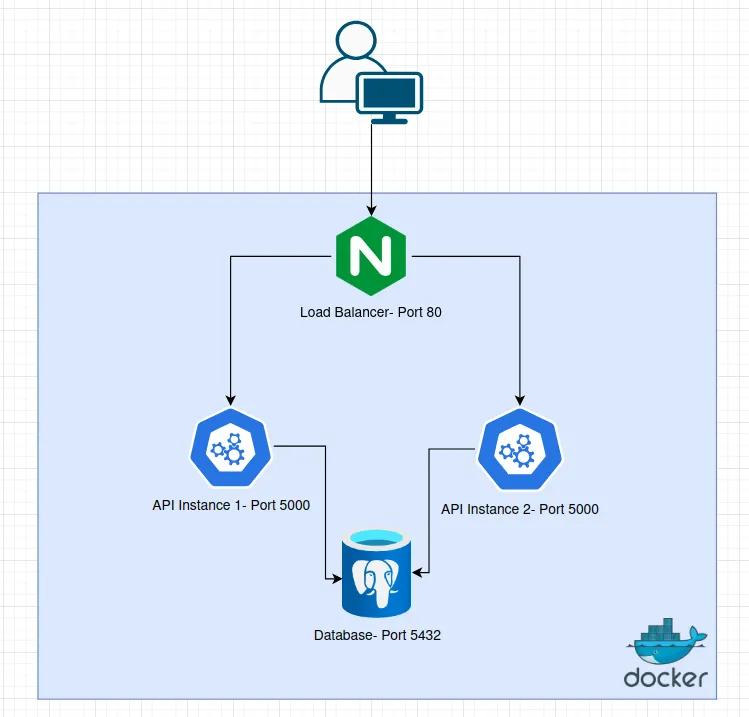

# Distributed Architecture with Load Balancing

A hands-on system desing project to understand how distributed architectures work.
Build with Docker, NGINX, Flask and PostreSQL


## Architecture


*Diagrama de la arquitectura del sistema*

## Technologies

- **Docker & Docker Compose** - Containerization and orchestration
- **NGINX** - Load balancer with round robin
- **Flask (Python)** - REST API
- **PostgreSQL** - Database

## How it works

The user sends a request to NGINX on port 80.
NGINX distributes the traffic between two API instances using round robin.
Both APIs connect to the same PostgreSQL database.
If one API goes down, NGINX automatically redirects traffic to the other.

## Project Structure
```
docker-load-balancer/
├── docker-compose.yml
├── api/
│   ├── app.py
│   ├── Dockerfile
│   └── requirements.txt
└── nginx/
    └── nginx.conf
```

## Getting Started

### Requirements

- Docker
- Docker Compose

### Run the project
```bash
docker-compose up --build
```

Then open your browser at `http://localhost`

### Stop the project
```bash
docker-compose down
```

## API Endpoints

| Endpoint | Description |
|----------|-------------|
| `GET /` | Returns the API instance name |
| `GET /db` | Checks database connection |

## Fault Tolerance Tests

### Test 1 - Load balancing
Refresh `http://localhost` several times and watch it alternate between `api-1` and `api-2`.

### Test 2 - Kill one API
```bash
docker stop docker-load-balancer_api1_1
```
The system keeps working with `api-2`. That is fault tolerance.

### Test 3 - Bring it back
```bash
docker start docker-load-balancer_api1_1
```
Traffic balances again between both instances.

## What I learned

- How to containerize services with Docker
- How a load balancer distributes traffic between instances
- What horizontal scaling means in practice
- How fault tolerance works in a distributed system
- How services communicate inside a Docker network
- How to orchestrate multiple containers with Docker Compose

## Author

Made by **jolmo** as a first system design project.
