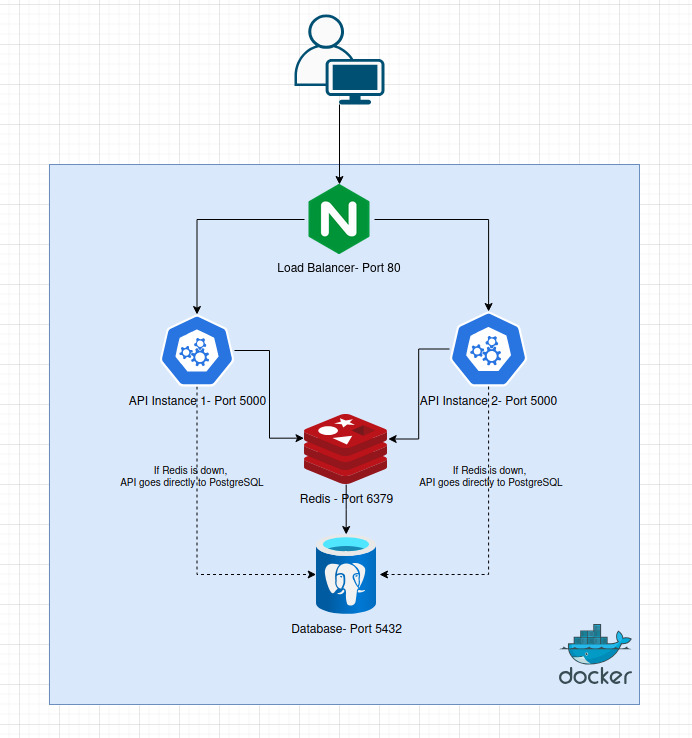

# Redis Cache Layer

> Evolution of project 01. After building the load balancer, the natural next step
> was to reduce the pressure on the database. By adding Redis as a cache layer,
> repeated queries never reach PostgreSQL, improving response times and availability.

A hands-on system design project to understand how caching works in a distributed architecture.
Built with Docker, NGINX, Flask, Redis and PostgreSQL.
## Architecture


*If Redis is down, the API goes directly to PostgreSQL*

## Technologies

- **Docker & Docker Compose** - Containerization and orchestration
- **NGINX** - Load balancer with round robin
- **Flask (Python)** - REST API
- **Redis** - In-memory cache layer
- **PostgreSQL** - Database

## How it works

The user sends a request to NGINX on port 80.
NGINX distributes the traffic between two API instances using round robin.
Each API first checks Redis for a cached response (cache hit).
If the data is not in Redis (cache miss), the API queries PostgreSQL and stores the result in Redis.
Cached data expires automatically after 30 seconds (TTL).
If Redis goes down, the API falls back to PostgreSQL directly.

## Project Structure
```
02-redis-cache/
├── docker-compose.yml
├── api/
│   ├── app.py
│   ├── Dockerfile
│   └── requirements.txt
└── nginx/
    └── nginx.conf
```

## Getting Started

### Requirements

- Docker
- Docker Compose

### Run the project
```bash
docker-compose up --build
```

Then open your browser at `http://localhost`

### Stop the project
```bash
docker-compose down
```

## API Endpoints

| Endpoint | Description |
|----------|-------------|
| `GET /` | Returns cache hit or miss + instance name |
| `GET /db` | Checks database connection |
| `GET /cache-status` | Shows cache state and TTL countdown |

## Cache Tests

### Test 1 - Cache miss then hit
1. Go to `http://localhost/cache-status` → you will see `miss`
2. Go to `http://localhost/` → first request, goes to PostgreSQL
3. Go to `http://localhost/cache-status` → now shows `hit` and TTL countdown

### Test 2 - TTL expiration
Wait 30 seconds after a cache hit and check `/cache-status` again.
The cache expires automatically and goes back to `miss`.

### Test 3 - Kill Redis
```bash
docker stop 02-redis-cache_redis_1
```
The API keeps working, falling back to PostgreSQL directly.
This proves Redis is an optimization, not a critical component.

## What I learned

- What a cache is and why it matters in distributed systems
- The difference between cache hit and cache miss
- What TTL means and how it controls cache expiration
- How to make a system resilient when a non-critical component fails
- How Redis works as an in-memory data store
- How to add a cache layer without changing the rest of the architecture

## Author

Made by **jolmo** as part of the system design journey.
